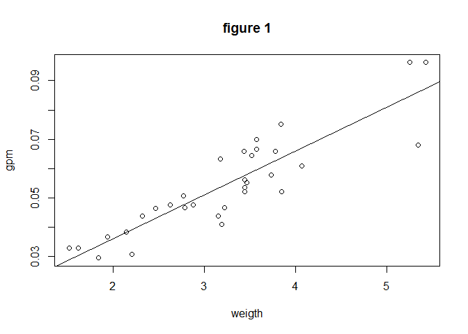
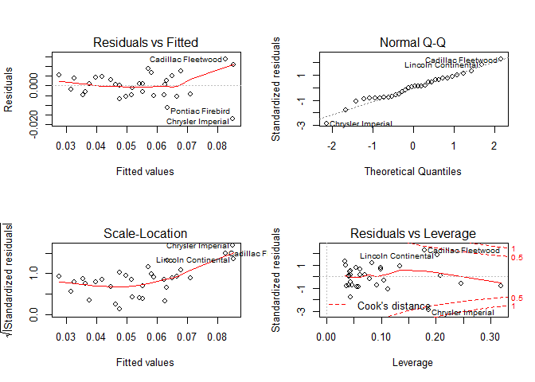
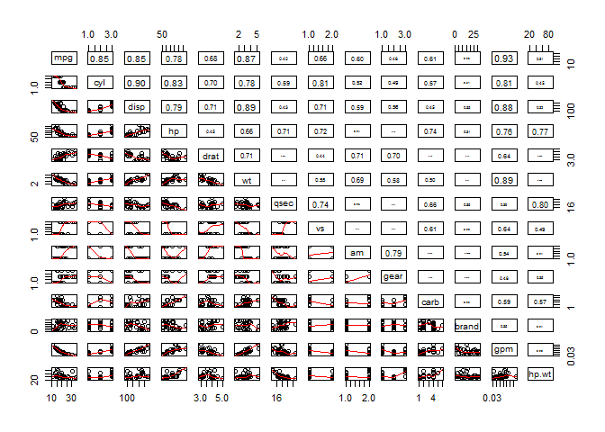

# What decides Fuel Economy of motors? 
Cheng Juan  
Thursday, January 22, 2015  

### Executive Summary

When you're shopping for a car, you might notice many different parameters offered as options and wonder how to choose. Fuel economy definitely is one of your considerations. In this artical, we are interested in undercovering the key factors that desides the fuel economy of a motor. As a result, we get a simple formula to predict gasoline (in gallon) per mile using both linear regression and physics analysis.  


###  Data Processing

The data, extracted from 1974 Motor Trend mgazine, complrise gasoline mileage in miles per gallon(`mpg`), and ten aspects of auto mobile design and performance for 32 automobiles(1973-1974 models)


```r
# loadi in the mtcars dataset
data(mtcars)

# transfor certain variables into factors.

mtcars$brand <- make.names(rownames(mtcars))

fl <- c("cyl", "vs", "gear", "carb", "am","brand")
mtcars[,fl] <- lapply(fl, function(fl) {factor(mtcars[,fl])})
# add brand column 
mtcars$gpm <- 1/mtcars$mpg
mtcars$hp.wt <- mtcars$hp/mtcars$wt

str(mtcars)
```

```
## 'data.frame':	32 obs. of  14 variables:
##  $ mpg  : num  21 21 22.8 21.4 18.7 18.1 14.3 24.4 22.8 19.2 ...
##  $ cyl  : Factor w/ 3 levels "4","6","8": 2 2 1 2 3 2 3 1 1 2 ...
##  $ disp : num  160 160 108 258 360 ...
##  $ hp   : num  110 110 93 110 175 105 245 62 95 123 ...
##  $ drat : num  3.9 3.9 3.85 3.08 3.15 2.76 3.21 3.69 3.92 3.92 ...
##  $ wt   : num  2.62 2.88 2.32 3.21 3.44 ...
##  $ qsec : num  16.5 17 18.6 19.4 17 ...
##  $ vs   : Factor w/ 2 levels "0","1": 1 1 2 2 1 2 1 2 2 2 ...
##  $ am   : Factor w/ 2 levels "0","1": 2 2 2 1 1 1 1 1 1 1 ...
##  $ gear : Factor w/ 3 levels "3","4","5": 2 2 2 1 1 1 1 2 2 2 ...
##  $ carb : Factor w/ 6 levels "1","2","3","4",..: 4 4 1 1 2 1 4 2 2 4 ...
##  $ brand: Factor w/ 32 levels "AMC.Javelin",..: 18 19 5 13 14 31 7 21 20 22 ...
##  $ gpm  : num  0.0476 0.0476 0.0439 0.0467 0.0535 ...
##  $ hp.wt: num  42 38.3 40.1 34.2 50.9 ...
```

### Exploratory Analysis

To explore various relationships between variables of interest, first, we scatter plot the variables and Pearson's correlation pair-wisely across the whole `mtcars` data-set (**Appendix- Fig 1**). As shown in the figure, it looks like variable `cyl`, `disp`, `hp`, `drat`, `wt`, `vs` and `am` could be used to predict `MPG`. on the other side, we also see strong correlation between these potential explanatory variables. For example, the correlation between `disp` and `cyl` is as high as 0.9. 

### Regression Analysis

One way to build a linear regression model is to scan among all possible variables combinations and find the **best model** by setting fitting criteria.For example, the stepwise model selection using AIC algorithm. In theory, this ensures we include variables with high significance and omit the others. The `best model` (see Appendix **Best model** section) gives that `mpg` could be explained by `cyl`,`hp`,`wt` and `am`. However, the result is hard to interpret somehow.  

But further study on the physical meanings of these variables, we found some interesting facts among these variables. For example, engine displacement(`disp`) is proportional to number of cylinders(`cyl`). Higher Rear axle ratio indicates higher tow capability but less fuel economy. If we think more on these variables, we found there are actually three types of variable, power-related, structure-related and performance-related. Power-related contains the variables of motor driving, like `cyl`, `disp`, `carb` and `V/S`. structure-related contains the `wt`, `am` ,`drat`,`gear` and `brand`. The performance-related ones are somehow the results of the above regressions. Gross horsepower (`hp`) is a measurement of the engine power. And 1/4 mile time (`qsec`) is a measurement of the acceleration capability of the motor. 

Let's first forget about these variables and image a car on the way. The engine provides the driving force by consuming gasoline. Some part of energy produced by gasoline burning is wasted due to structure and engine design. Finally this force drives the car move along the highway carry its own mass. Now it is clear that our gasoline is spent on engine waste, moving the car body and real work. 

#### Model building and selection

Now, let's put these variables into our theory. In Velleman's [paper](http://www.mortality.org/INdb/2008/02/12/8/document.pdf), he suggests use GPM (=1/MPG, gallons per mile) as the predictor since it states that the energy consumption per mile. 

Correlations of `gpm` against promising carriers suggest `wt` as the best single predictor of `gpm`. `wt` also plays a great role according to our previous analysis. Here is the regression result. 


```r
gpmwt <- lm(gpm ~ wt, data = mtcars)
gpmwt
plot(mtcars$wt, mtcars$gpm, xlab="weigth", ylab="gpm", main="figure 1")
abline(gpmwt)
```

 

```
## 
## Call:
## lm(formula = gpm ~ wt, data = mtcars)
## 
## Coefficients:
## (Intercept)           wt  
##    0.006169     0.014938
```

In the above model, we only consider only the basic consumption by motor weight. However, it is also possible that some of the cars are over-powered, for example, sports car. In Velleman's [paper](http://www.mortality.org/INdb/2008/02/12/8/document.pdf), he uses HP/Wt as another carrier.  


```r
gpm2 <- lm(gpm ~ wt + hp.wt, data = mtcars)
gpm2

summary(gpm2)

par(mfrow=c(2, 2))
plot(gpm2)
```

 

```
## 
## Call:
## lm(formula = gpm ~ wt + hp.wt, data = mtcars)
## 
## Coefficients:
## (Intercept)           wt        hp.wt  
##   -0.004015     0.014722     0.000240  
## 
## 
## Call:
## lm(formula = gpm ~ wt + hp.wt, data = mtcars)
## 
## Residuals:
##        Min         1Q     Median         3Q        Max 
## -0.0169714 -0.0046822  0.0005312  0.0042744  0.0135097 
## 
## Coefficients:
##               Estimate Std. Error t value Pr(>|t|)    
## (Intercept) -4.015e-03  5.120e-03  -0.784  0.43929    
## wt           1.472e-02  1.216e-03  12.111 7.24e-13 ***
## hp.wt        2.400e-04  7.302e-05   3.286  0.00266 ** 
## ---
## Signif. codes:  0 '***' 0.001 '**' 0.01 '*' 0.05 '.' 0.1 ' ' 1
## 
## Residual standard error: 0.006612 on 29 degrees of freedom
## Multiple R-squared:  0.8484,	Adjusted R-squared:  0.8379 
## F-statistic: 81.13 on 2 and 29 DF,  p-value: 1.322e-12
```

Three observations are made from the above plots

- Most of points in the Residuals vs. Fitted plot are randomly scattered on the plot that verifies the independence condition.

- Most points of Normal Q-Q plot fall on the line indicating sample points are generally normally distributed.

- The Scale-Location plot consists of points scattered is a little bit upward at high value suggesting a increase of variance at high end car. 

- There are some distinct points of interest (outliers or leverage points) that may indicate values of increased leverage of outliers.

Although imperfection of the model according to the above diagnostics, from the R-squared and p value, we could still confidently express that variable `gpm` is approximately linear in `wt` and `hp.wt`.


### Conclusions

Based on the analysis above, both physically and statistically, we can conclude that:

$$ gpm = 0.014722* wt + 0.000240* hp.wt -0.004015 $$ 

This mean: 

-  gasoline per mile will increase 1% by for every 1000 lb increase in motor weight   
   (adjusted by hp.wt).

- At a constant motor weight, gpm will increase as the gross horsepower increase in a non-linear fashion. 


### Appendix


####  Pair plot


```r
panel.cor <- function(x, y, digits=2, prefix="", cex.cor, ...)
{
        usr <- par("usr"); on.exit(par(usr))
        par(usr = c(0, 1, 0, 1))
        r <- abs(cor(x, y))
        txt <- format(c(r, 0.123456789), digits=digits)[1]
        txt <- paste(prefix, txt, sep="")
        if(missing(cex.cor)) cex.cor <- 0.8/strwidth(txt)
        text(0.5, 0.5, txt, cex = cex.cor * r)
}

pairs(mpg ~ ., data = mtcars,lower.panel=panel.smooth, upper.panel=panel.cor)
```

 


#### best model 


```r
# initialmodel <- lm(mpg ~ ., data = mtcars)
# bestmodel <- step(initialmodel, direction = "both")
# summary(bestmodel)
```

shared in [Rpub](http://rpubs.com/Cjtouzi/fueleco)

