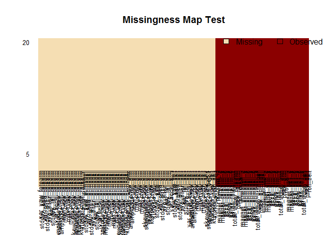
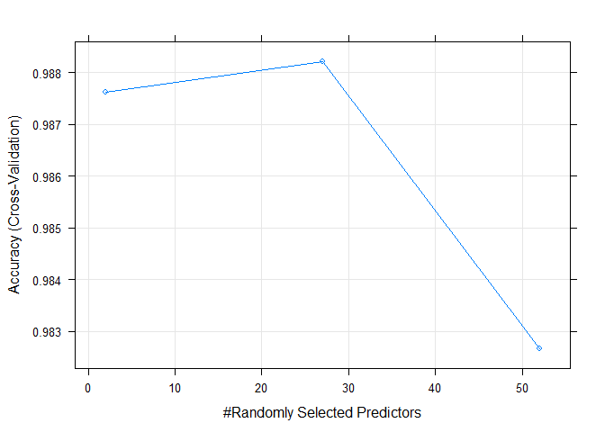
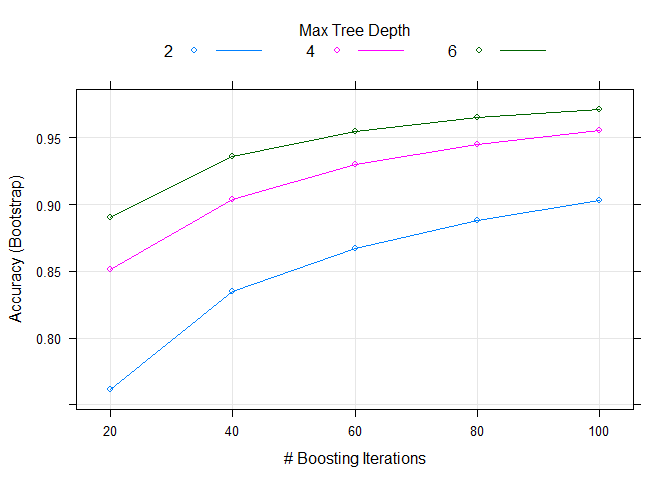
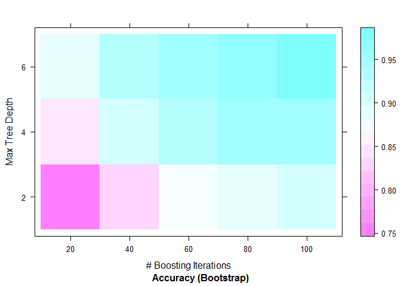
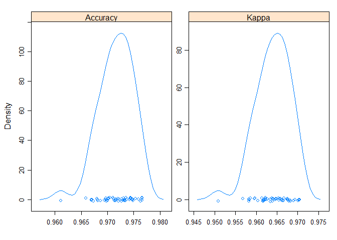
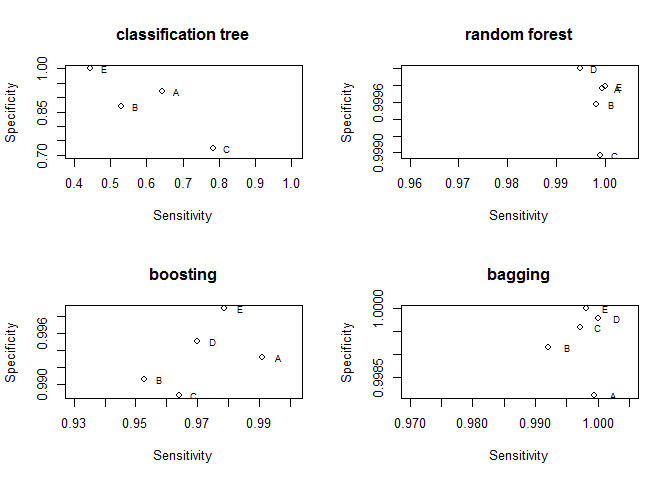

# An example of practical machine learning using R
Cheng Juan  
Monday, February 09, 2015  

### Summary

===========================

The R language has a rich set of modeling functions for classfication. And `caret` package tries to generize and simplize the model building process by eliminating syntactical differences between models[1](http://www.jstatsoft.org/v28/i05/paper). In this report, an example will illustrate the application of some of the tools provided in `caret` package and other packages. 

The dataset using in this report is called  Weight Lifting Exercise Dataset. The aim of the dataset is to build a prediction model on common incorrect gestures during barbell lifts based on several variables collected by accelerometers. See more details on the project description [here](http://groupware.les.inf.puc-rio.br/har)(see the section on the Weight Lifting Exercise Dataset). 

To find a accurate prediction model, we first eliminate the redundant features with too many missing values. The remain dataset is divide into three part: training set, validation set and test set. The training set is used to train four models including classification tree, random forest, boosting and bagging. The out-of-sample accuracy is measured using validation set. By comparing the out-of-sample accuracy, we select random forest as our final model with a overall accuracy 0.9946. Finally we choose the random forest model in the testing set and we find that the accuracy is 100% in the test set.


### Background

===========================     

#### Background of Data

Using devices such as Jawbone Up, Nike FuelBand, and Fitbit it is now possible to collect a large amount of data about personal activity relatively inexpensively. In this project, we use data from accelerometers on the belt, forearm, arm, and dumbell of 6 participants. Six young health participants were asked to perform one set of 10 repetitions of the Unilateral Dumbbell Biceps Curl in five different fashions: exactly according to the specification (Class A), throwing the elbows to the front (Class B), lifting the dumbbell only halfway (Class C), lowering the dumbbell only halfway (Class D) and throwing the hips to the front (Class E). 


Read [more](http://groupware.les.inf.puc-rio.br/har#ixzz3RDCCaU6P)


#### Technical Background       

In this project, we train four different machine learning models including classification tree, random forest, boosting and bagging and select the best one according to their accuracy in the validation set. In this section, we make a informal introduction of these four models. 

Classification tree is a method to map observations on different features about of an item to its class labels. Such process is illustrated by a tree-like structure. Each leave of this structure represents the class label of a particular item and each branch represent a conjunction of feature that leads to a label. 

Random forest, boosting and bagging here are developed to solve the problem of over-fitting of the simple classification tree method. Random forest grows multiple trees by using only a random subset of features. Boosting is referred to the process of tuning a weaker predictor into a single strong learner, in an iterative fashion. Principally, boosting method tries to fit the residual at each iteration and then add up all the weaker predictor at each iteration into one single stronger learner. Bagging also known as bootstrap aggregating, generate a bigger training set by uniformly sampling with replacement from original training set. (Such sampling process is often called bootstrapping). Then the fittings of each bootstrap sample are combined by voting in the classification problem.          


### Feature Extraction

===========================


In this section, we will load both the training and testing dataset downloaded [here](http://groupware.les.inf.puc-rio.br/static/WLE/WearableComputing_weight_lifting_exercises_biceps_curl_variations.csv). The `53` activity quality related features are extracted both in training (named as `build`) and testing dataset (named as `test`). Then we save 70% of `build` dataset as training set (named as `train`) and the remaining 30% as a validation (named as `val`) dataset. Finally we have three dataset: The `train` for model building. `val` data for out-of-sample error measurement and model selection. `test` for final model test. 


The `Amelia` R package is a toolbox around missing values. The missingness map in `Amelia` R package helps us to visualize the missing values in our dataset. In the missingness map, we find that the percentage of missing values in some of the features is too high and it's not appropriate to perform any inputting Technics. Therefore, we exclude those features from our predictor list. 


```r
# loading data
library(caret)

build <- read.csv("./pml-training.csv")
test <- read.csv("./pml-testing.csv")

dim(build)
dim(test)

# preprocessing
build[,7:159] <- sapply(build[,7:159],as.numeric) 
test[,7:159] <- sapply(test[,7:159], as.numeric) 


## feature extraction & selection

# select the activity features only
build <- build[8:160]
test <- test[8:160]


# check missing values
library(Amelia)
```

```
## Loading required package: Rcpp
## ## 
## ## Amelia II: Multiple Imputation
## ## (Version 1.7.3, built: 2014-11-14)
## ## Copyright (C) 2005-2015 James Honaker, Gary King and Matthew Blackwell
## ## Refer to http://gking.harvard.edu/amelia/ for more information
## ##
```

```r
missmap(test, main = "Missingness Map Test")
```

 

```r
# since test set only contains 20 observations. 
# remove features that contains NAs in test set
nas <- is.na(apply(test,2,sum))

test <- test[,!nas]
dim(test)
build <- build[,!nas]

# create validation data set using Train 
inTrain <- createDataPartition(y=build$classe, p=0.7, list=FALSE)
train <- build[inTrain,]
val <- build[-inTrain,]
rm(inTrain,nas,build)
```

Here is a summary of the final datasets for model building after excluding those features  


|Dataset | # of observations | # of features|
|--------|-------------------|--------------|
|training |13737|53|
|validation |5885|53|
|test| 20|53|

### Classification Model

===========================

In this section, our plan is to build classification tree, random forest, boosting model and bagging for activity classification and then choose the one with the best the out-of-sample accuracy.


#### Classification tree

In the first test, we use a regression tree with the method `rpart`. 


```r
library(rattle)
library(rpart.plot)
library(rpart)
##  regression tree model
# set.seed(123)
# Mod0 <- train(classe ~ .,data=train, method="rpart")
# save(Mod0,file="Mod0.RData")

load("Mod0.RData")
fancyRpartPlot(Mod0$finalModel)
```

 

```r
# out-of-sample errors of regression tree model using validation dataset 
pred0 <- predict(Mod0, val)
cm0 <- confusionMatrix(pred0, val$classe)
cm0$table
library(knitr)
# kable(cm0$table)
```

```
##           Reference
## Prediction    A    B    C    D    E
##          A 1076  224   32   56   14
##          B  175  604   51  139  254
##          C  311  259  804  501  266
##          D  110   52  139  268   67
##          E    2    0    0    0  481
```
    
The model (shows in the tree plot) preforms poorly with a overall accuracy 0.55. Specifically, it fails to identify the class D (see confusion matrix above) and tends to assign most of cases to the class A. 


#### Random forest

Now, we run a random forest algorithm. `caret` use cross validation to select the number of the predictors. Here we use three fold cross validation in this model due the computational cost.   


```r
set.seed(123)

# random forest model
# system.time(Mod1 <- train(classe ~ ., method = "rf", 
#                data = train, importance = T, 
#                trControl = trainControl(method = "cv", number = 3)))
# save(Mod1,file="Mod1.RData")

load("Mod1.RData")
# Mod1$finalModel
vi <- varImp(Mod1)
vi$importance[1:10,]

# out-of-sample errors of random forest model using validation dataset 
pred1 <- predict(Mod1, val)
cm1 <- confusionMatrix(pred1, val$classe)


# plot roc curves
# library(pROC)
# pred1.prob <- predict(Mod1, val, type="prob")
# pred1.prob$
# roc1 <-  roc(val$total_accel_belt, pred1.prob$E)
# plot(roc1, print.thres="best", print.thres.best.method="closest.topleft")
# coord1 <- coords(roc1, "best", best.method="closest.topleft",
#                           ret=c("threshold", "accuracy"))
# coord1


# summary of final model
# Mod1$finalModel
plot(Mod1)
```

 

```r
plot(Mod1$finalModel)
```

 

```r
plot(varImp(Mod1), top = 10)
```

 

```
##                          A         B         C         D          E
## roll_belt        82.759276 94.035593 91.012759 83.423775 100.000000
## pitch_belt       27.082772 94.968938 61.221630 49.343371  43.252939
## yaw_belt         74.404386 63.146457 70.748778 64.467045  50.757037
## total_accel_belt  3.709482  6.142350  5.024616  4.822766   2.436515
## gyros_belt_x     25.855751  9.453453 16.380724  8.033793  11.331922
## gyros_belt_y      2.049543 11.947830 12.322345  8.131822  13.845522
## gyros_belt_z     28.037973 29.452819 30.105131 21.025044  44.789433
## accel_belt_x      4.608242  6.947156  7.917366  1.365975   5.694481
## accel_belt_y      2.446740  8.595765  8.302915  8.522882   1.079211
## accel_belt_z     12.822200 22.184954 18.845292 16.853367  12.001318
```

The cross validation graph shows that the model with 27 predictors is selected by the best accuracy. The final model plot tells that the overall error converge at around 100 trees. So it is possible to speed up our algo by tuning the number of trees. The accuracy of the random forest model is 0.99. A list of top ten important variables in the model is also given regarding each class of activity.  


#### Boosting

In the boosting tree model, we first use three fold cross-validation 


```r
# simple boost tree fitting model
# set.seed(2)
# system.time(Mod2 <- train(classe ~ ., 
#                   method = "gbm", 
#                   data = train, 
#                   verbose = F, 
#                   trControl = trainControl(method = "cv", number = 3)))
# save(Mod2,file="Mod2.RData")
##145.97s

load("Mod2.RData")

# out-of-sample errors using validation dataset 
pred2 <- predict(Mod2, val)
cm2 <- confusionMatrix(pred2, val$classe)
cm2$overall
```

```
##       Accuracy          Kappa  AccuracyLower  AccuracyUpper   AccuracyNull 
##     0.97315208     0.96603184     0.96869547     0.97713085     0.28445200 
## AccuracyPValue  McnemarPValue 
##     0.00000000     0.00361484
```


Also we can tune over the number of trees and the complexity of the tree. For our data, we will generate a grid of 15 combinations and use the tuneGrid argument to the train function to use these values. 


```r
## model tuning 
# gbmGrid <- expand.grid(.interaction.depth=(1:3)*2, .n.trees=(1:5)*20, .shrinkage=.1)
# bootControl <- trainControl(number=50)
# set.seed(2)
# gmbFit<- train(classe ~ ., 
#                method = "gbm", 
#                data = train, 
#                verbose = F, 
#                trControl = bootControl, 
#                bag.fraction=0.5,
#                tuneGrid=gbmGrid)
# save(gmbFit,file="gmbFit.RData")

load("gmbFit.RData")
plot(gmbFit)
```

 

```r
plot(gmbFit,plotType = "level")
```

 

```r
resampleHist((gmbFit))
```

 

```r
# out-of-sample errors using validation dataset 
predgmb <- predict(gmbFit, val)
cmgmb <- confusionMatrix(pred2, val$classe)
cmgmb$overall
```

```
##       Accuracy          Kappa  AccuracyLower  AccuracyUpper   AccuracyNull 
##     0.97315208     0.96603184     0.96869547     0.97713085     0.28445200 
## AccuracyPValue  McnemarPValue 
##     0.00000000     0.00361484
```

We find that the accuracy of both three folds model and fine tune one are the same, 0.973. Therefore,we choose the three folds one as our boosting model. 

#### Bagging            

In the bagging model, we simply use the default setting. 


```r
# system.time({Mod3 <- train(classe ~ .,data=train,method="treebag")})
## 1452.68s
# save(Mod3,file="Mod3.RData")

load("Mod3.RData")
pred3 <- predict(Mod3, val)
cm3 <- confusionMatrix(pred3, val$classe)
# cm3$overall
varImp(Mod3)
plot(varImp(Mod3), top = 10)
```

 

```
## treebag variable importance
## 
##   only 20 most important variables shown (out of 52)
## 
##                   Overall
## roll_belt          100.00
## yaw_belt            72.74
## magnet_dumbbell_y   66.87
## pitch_forearm       65.42
## pitch_belt          64.95
## roll_forearm        54.19
## magnet_dumbbell_z   47.31
## roll_dumbbell       43.96
## accel_dumbbell_y    39.62
## magnet_dumbbell_x   36.59
## magnet_belt_y       33.07
## accel_belt_z        32.83
## accel_dumbbell_z    25.35
## yaw_arm             25.28
## magnet_belt_z       25.18
## accel_forearm_x     24.25
## gyros_belt_z        21.63
## total_accel_belt    19.91
## magnet_belt_x       19.84
## magnet_forearm_z    19.57
```


#### Prediction Model Selection         

Now, we summarize the our testing result in one table. We find that random forest has the highest accuracy. 


```r
re <- data.frame(Tree=cm0$overall[1], 
                    rf=cm1$overall[1], 
                    boosting=cm2$overall[1],
                    bagging=cm3$overall[1])
library(knitr)
re
```

```
##               Tree        rf  boosting   bagging
## Accuracy 0.5493628 0.9984707 0.9731521 0.9974511
```


We plot out both specificity versus sensitivity for all four models.The figures show random forest is better in both aspects. Therefore, we select random forest as our final prediction model. 


```r
# compare the sensitivity and specificity btw random forest and boosting method

par(mfrow=c(2,2))
plot(cm0$byClass, main="classification tree", xlim=c(0.4, 1.005), ylim=c(0.7,1))
text(cm0$byClass[,1]+0.04, cm0$byClass[,2], labels=LETTERS[1:5], cex= 0.7)
plot(cm1$byClass, main="random forest", xlim=c(0.96, 1.005))
text(cm1$byClass[,1]+0.003, cm1$byClass[,2], labels=LETTERS[1:5], cex= 0.7)
plot(cm2$byClass, main="boosting", xlim=c(0.93, 1.001))
text(cm2$byClass[,1]+0.005, cm2$byClass[,2], labels=LETTERS[1:5], cex= 0.7)
plot(cm3$byClass, main="bagging", xlim=c(0.97, 1.005))
text(cm3$byClass[,1]+0.003, cm3$byClass[,2], labels=LETTERS[1:5], cex= 0.7)
```

 


### Prediction and Output

===========================

In this section, we use random forest model we built in last section to predict the test data and output the result into text files. After comparing with the correct results, our random forest model gives 100% prediction accuracy. 


```r
test$classe <- as.character(predict(Mod1, test))

# write prediction files
pml_write_files = function(x){
        n = length(x)
        for(i in 1:n){
                filename = paste0("./predict/problem_id_", i, ".txt")
                write.table(x[i], file = filename, quote = FALSE, row.names = FALSE, col.names = FALSE)
        }
}
# pml_write_files(test$classe)
Mod1$finalModel
# summary(test$classe)
```

```
## 
## Call:
##  randomForest(x = x, y = y, mtry = param$mtry, importance = ..1) 
##                Type of random forest: classification
##                      Number of trees: 500
## No. of variables tried at each split: 27
## 
##         OOB estimate of  error rate: 0.64%
## Confusion matrix:
##      A    B    C    D    E class.error
## A 3901    3    0    0    2 0.001280082
## B   18 2633    6    1    0 0.009405568
## C    0   13 2376    7    0 0.008347245
## D    0    0   28 2223    1 0.012877442
## E    0    1    4    4 2516 0.003564356
```

### Condclusion and Futurework

===========================

The aim of this project is to build a accurate prediction model on common incorrect gestures during barbell lifts based on several variables collected by accelerometers. To achieve this, we compare the performance of four methods: classification trees, random forest, booting trees and bagging and finally select random forest as our prediction model due to its high accuracy in the cross validation. 

During the process of model building, we explore a few visualization and metrics tools that help us on data preparation, model building and tuning and performance characterizing. For future work, it is possible to further improve the model performance by finetuning the model parameters or deeper understanding features. It is also interesting to use parallel processing Technics to accelerate the model.  


publish on [rpub](http://rpubs.com/Cjtouzi/64455)


