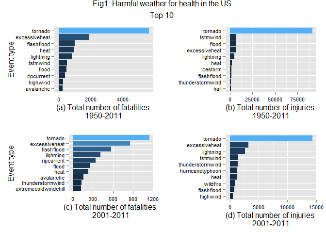
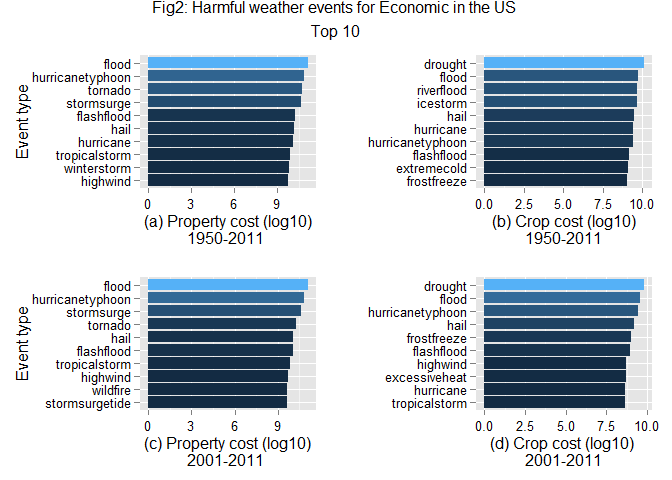

# The WORST Weather Event in USA
CJ  
Dec, 17th, 2014  


### Synopsis  

Storms and other severe weather events can cause both public health and economic problems for communities and municipalities. Many severe events can result in fatalities, injuries, and property damage, and preventing such outcomes to the extent possible is a key concern. This report summaries the Top10 harmful weather events on population health or economics across the USA by exploring the U.S. National Oceanic and Atmospheric Administration's (NOAA) storm database. 

### Data Processing  

#### Data source

The detail information of NOAA storm database is [here]("http://www.ncdc.noaa.gov/stormevents/ftp.jsp"). The data source in this report is from a comma-separated-value file available [here]("https://d396qusza40orc.cloudfront.net/repdata%2Fdata%2FStormData.csv.bz2"). 


```r
# read in the data
# please change the following directory to your own data directory
 storm <- read.csv("D:/GitHub/datasciencecoursera/Repro/data/StormData.csv")    
```

#### Data cleaning 

In raw data `storm`, factor `EVTYPE` is not uniform formatted. For instance, events type `Cold` and `COLD` should be referring the same weather events. And `COASTALFLOOD` and `COASTAL FLOOD` must be the same type. However, the boundary between some terms are very clear. For example, `FLASH FLOOD LANDSLIDES` and  `FLASH FLOOD/ FLOOD`, which could be classified into `FLOOD` category or also could be treated as different factors. Here cleaning is performed using the following code chunks. 


```r
# data cleaning 


# translate all letters to lowercase
event_type <- tolower(storm$EVTYPE)
length(unique(event_type))

# remove all punct. characters
event_type <- gsub("[[:blank:][:punct:]+]", "", event_type)

# save to EventTypeCode 
storm$EventTypeCode<- event_type
length(unique(storm$EventTypeCode))
```

```
## [1] 898
## [1] 818
```

### Analysis 

#### Dangerous Events for Population Health

To find out the event types that are most harmful to population health, the number of fatalities and injuries are aggregated by the event type among all data available (1950-2011). 


```r
library(plyr)

# sum the number of fatalitites and injuries(1950-2011)
fatalCount <- ddply(storm, .(EventTypeCode), summarize, fatalities = sum(FATALITIES))
injurCount <- ddply(storm, .(EventTypeCode), summarize, injuries = sum(INJURIES))


# TOP 10 list ordering by the event type

fatalTop10 <- fatalCount[order(fatalCount$fatalities,decreasing = T)[1:10],] 
fatalTop10[1,1:2]

injurTop10 <- injurCount[order(injurCount$injuries,decreasing = T)[1:10],] 
injurTop10[1,1:2]
```

```
##     EventTypeCode fatalities
## 693       tornado       5633
##     EventTypeCode injuries
## 693       tornado    91346
```

Also, it is interesting to find out the list of most harmful event types to population health for the recent 10 years since this list might change along time as the technology development and population growth. 


```r
# get recent 10 years data and set as storm10year 
storm$BGN_DATE <- as.POSIXct(strptime(storm$BGN_DATE, "%m/%d/%Y %H:%M:%S"))
head(storm$BGN_DATE, n=2)
date <- as.POSIXct(strptime("01/01/2001 00:00:00", "%m/%d/%Y %H:%M:%S"))
storm10year <- storm[storm$BGN_DATE>date, ]
head(storm10year$BGN_DATE, n=2)


# sum the number of fatalitites and injuries(2001-2011)

fatalCount10year <- ddply(storm10year, .(EventTypeCode), summarize, fatalities = sum(FATALITIES))

injurCount10year <- ddply(storm10year, .(EventTypeCode), summarize, injuries = sum(INJURIES))

# TOP 10 list ordering by the event type

fatalTop10In10Year <- fatalCount10year[order(fatalCount10year$fatalities,decreasing = T)[1:10],] 
fatalTop10In10Year[1,1:2]
injurTop10In10Year <- injurCount10year[order(injurCount10year$injuries,decreasing = T)[1:10],] 
injurTop10In10Year[1,1:2]
```

```
## [1] "1950-04-18 MALT" "1950-04-18 MALT"
## [1] NA               "2001-02-25 MYT"
##     EventTypeCode fatalities
## 132       tornado       1152
##     EventTypeCode injuries
## 132       tornado    14331
```

#### Economic Impact of Weather Events

To find out the event types that are most harmful to economics, the property damage (in dollars) and crop damage (in dollars) are aggregated by the event type among all data available (1950-2011). 

However, the property damage in dollars and crop damage in dollars are not provided by the raw data.  
In this code chunk, we calculate these two values and save in `EcoDmg`.  


```r
# transform the cost into dollars and save as propDmgDollar and cropDmgDollar

levels(storm$PROPDMGEXP)
storm$PROPDMGEXP <- as.factor(toupper(storm$PROPDMGEXP))
storm$CROPDMGEXP <- as.factor(toupper(storm$CROPDMGEXP))

levels(storm$PROPDMGEXP)

exp_transform <- function(e) {
        # h -> hundred, k -> thousand, m -> million, b -> billion   
        #switch(e,'h'=2,'H'=2,0)
        if (e %in% c('H')) return(2)
        if (e %in% c('K')) return(3)
        if (e %in% c('M')) return(6)
        if (e %in% c('B')) return(9)
        if ((as.numeric(e)) %in% seq(1:8)) return(as.numeric(e)) 
        if (e %in% c('', '-', '?', '+')) return(-1)
        return(-2)
        
}

propDmgExp <- sapply(storm$PROPDMGEXP, FUN=exp_transform)
propDmgDollar <- as.numeric(storm$PROPDMG * (10 ** propDmgExp))
rm(propDmgExp)
cropDmgExp <- sapply(storm$CROPDMGEXP, FUN=exp_transform)
cropDmgDollar<- as.numeric(storm$CROPDMG * (10 ** cropDmgExp))
rm(cropDmgExp)

# create a new variable EcoDmg for further analysis

EcoDmg<- data.frame(BGN_DATE=storm$BGN_DATE, EventTypeCode=storm$EventTypeCode, propDmgDollar, cropDmgDollar)
```

```
##  [1] ""  "-" "?" "+" "0" "1" "2" "3" "4" "5" "6" "7" "8" "B" "h" "H" "K"
## [18] "m" "M"
##  [1] ""  "-" "?" "+" "0" "1" "2" "3" "4" "5" "6" "7" "8" "B" "H" "K" "M"
```

Then the property damage (in dollars) and crop damage (in dollars) are aggregated by the event type among all data available (1950-2011). 


```r
# sum total dollar cost of properties and crop(1950-2011)

PropDmgCost <- ddply(EcoDmg, .(EventTypeCode), summarize, propDmg = sum(propDmgDollar))
CropDmgCost <- ddply(EcoDmg, .(EventTypeCode), summarize, CropDmg = sum(cropDmgDollar))

# TOP 10 list ordering by the event type
PropDmgTop10 <- PropDmgCost[order(PropDmgCost$propDmg,decreasing = T)[1:10],] 
PropDmgTop10[1,1:2]

CropDmgTop10 <- CropDmgCost[order(CropDmgCost$CropDmg,decreasing = T)[1:10],] 
CropDmgTop10[1,1:2]
```

```
##     EventTypeCode      propDmg
## 138         flood 144657709870
##    EventTypeCode     CropDmg
## 73       drought 13972566000
```

The top 10 list of most costly event types to economics for the recent 10 years are also summarized here. 


```r
# subset recent 10 years ecodmg data
date <- as.POSIXct(strptime("01/01/2001 00:00:00", "%m/%d/%Y %H:%M:%S"))
EcoDmg10year <- EcoDmg[EcoDmg$BGN_DATE>date,]
dim(EcoDmg10year)

# sum total dollar cost of properties and crop(2001-2010)

PropDmgCost10year <- ddply(EcoDmg10year, .(EventTypeCode), summarize, propDmg = sum(propDmgDollar))
CropDmgCost10year <- ddply(EcoDmg10year, .(EventTypeCode), summarize, CropDmg = sum(cropDmgDollar))

# TOP 10 list ordering by the event type

PropDmg10yearTop10 <- PropDmgCost10year[order(PropDmgCost10year$propDmg,decreasing = T)[1:10],] 
PropDmg10yearTop10[1,1:2]

CropDmg10yearTop10 <- CropDmgCost10year [order(CropDmgCost10year$CropDmg,decreasing = T)[1:10],] 
CropDmgTop10[1,1:2]
```

```
## [1] 488665      4
##    EventTypeCode      propDmg
## 41         flood 133972419530
##    EventTypeCode     CropDmg
## 73       drought 13972566000
```

### Results

#### Health impact of weather events 

The following plot shows top 10 dangerous weather event types on fatalities and injuries. Tornadoes cause most number of deaths and injuries among all event types. More than 5,000 deaths and more than 20,000 injuries in the last 60 years in US are due to `tornadoes`. The other event types that are most dangerous as to population health are `excessive heat` and `tstmwind`.

**Fig1(c-d)** show top 10 dangerous weather event types on fatalities and injuries for the recent 10 years. Comparing with top 10 list for the last 60 years, a few changes appear. For example, `excessiveheat` rank higher in the recent TOP 10 injuries list. Another example is that `extremecoldwindchill` occures in the crrent TOP fatalities list.   


```r
# plot 

library(ggplot2)
library(gridExtra)


p1 <- ggplot(data=fatalTop10,
             aes(x=reorder(EventTypeCode, fatalities ), y=fatalities , fill=fatalities)) +
        geom_bar(stat="identity") +
        coord_flip() +
        theme(axis.text.x = element_text(size=8, colour = rgb(0,0,0)))+
        theme(axis.text.y = element_text(size=8, colour = rgb(0,0,0)))+
        ylab("(a) Total number of fatalities \n1950-2011") +
        xlab("Event type") +
        theme(legend.position="none")

p2 <- ggplot(data=injurTop10,
             aes(x=reorder(EventTypeCode, injuries), y=injuries, fill=injuries)) +
        geom_bar(stat="identity") +
        coord_flip() + 
        theme(axis.text.x = element_text(size=8, colour = rgb(0,0,0)))+
        theme(axis.text.y = element_text(size=8, colour = rgb(0,0,0)))+
        ylab("(b) Total number of injuries \n1950-2011") +
        xlab("") +
        theme(legend.position="none")

p3 <- ggplot(data=fatalTop10In10Year,
             aes(x=reorder(EventTypeCode, fatalities ), y=fatalities , fill=fatalities)) +
        geom_bar(stat="identity") +
        coord_flip() +
        theme(axis.text.x = element_text(size=8, colour = rgb(0,0,0)))+
        theme(axis.text.y = element_text(size=8, colour = rgb(0,0,0)))+
        ylab("(c) Total number of fatalities \n2001-2011\n") +
        xlab("Event type") +
        theme(legend.position="none")

p4 <- ggplot(data=injurTop10In10Year,
             aes(x=reorder(EventTypeCode, injuries), y=injuries, fill=injuries)) +
        geom_bar(stat="identity") +
        coord_flip() + 
        ylab("(d) Total number of injuries \n2001-2011") +
        xlab("") +
        theme(axis.text.x = element_text(size=8, colour = rgb(0,0,0)))+
        theme(axis.text.y = element_text(size=8, colour = rgb(0,0,0)))+
        theme(legend.position="none")

grid.arrange(p1, p2, p3, p4, main="Fig1: Harmful weather for health in the US \nTop 10 ")
```

 

#### Ecnomics impact of weather events

The following plot shows the most costly severe weather event types with respect to economic.Both   `Property Cost` and `Crop Cost` are given in logarithmic scale due to large range of values. The data shows that `floods` cost the largest property damages among weather-related natural disasters. Note that, due to untidy nature of the available data, type `flood` and `flash flood` are separate values and might be merged.The most severe weather event in terms of crop damage is the `drought`. In the last half century, the drought has caused more than 10 billion dollars damage. Other severe crop-damage-causing event types are `floods` and `icestorm`. In the list of recent 10 years, `stormsurg` replace `tornado` becoming NO.3 most property costly event. And `hurricanetyphnoon` becomes No. 3 in the crop cost list. 


```r
library(ggplot2)
library(gridExtra)


p1 <- ggplot(data=PropDmgTop10,
             aes(x=reorder(EventTypeCode, propDmg), y=log10(propDmg), fill=propDmg)) +
        geom_bar(stat="identity") +
        coord_flip() +
        ylab("(a) Property cost (log10)\n1950-2011 ") +
        xlab("Event type") +
        theme(axis.text.x = element_text(size=10, colour = rgb(0,0,0)))+
        theme(axis.text.y = element_text(size=10, colour = rgb(0,0,0)))+
        theme(legend.position="none")


p2 <- ggplot(data=CropDmgTop10,
             aes(x=reorder(EventTypeCode, CropDmg), y=log10(CropDmg), fill=CropDmg)) +
        geom_bar(stat="identity") +
        coord_flip() + 
        ylab("(b) Crop cost (log10)\n1950-2011") +
        xlab("") +
        theme(axis.text.x = element_text(size=10, colour = rgb(0,0,0)))+
        theme(axis.text.y = element_text(size=10, colour = rgb(0,0,0)))+
        theme(legend.position="none")


p3 <- ggplot(data=PropDmg10yearTop10,
             aes(x=reorder(EventTypeCode, propDmg), y=log10(propDmg), fill=propDmg)) +
        geom_bar(stat="identity") +
        coord_flip() +
        theme(axis.text.x = element_text(size=10, colour = rgb(0,0,0)))+
        theme(axis.text.y = element_text(size=10, colour = rgb(0,0,0)))+
        ylab("(c) Property cost (log10)\n2001-2011 ") +
        xlab("Event type") +
        theme(legend.position="none")


p4 <- ggplot(data=CropDmg10yearTop10,
        aes(x=reorder(EventTypeCode, CropDmg), y=log10(CropDmg), fill=CropDmg)) +
        geom_bar(stat="identity") +
        coord_flip() + 
        theme(axis.text.x = element_text(size=10, colour = rgb(0,0,0)))+
        theme(axis.text.y = element_text(size=10, colour = rgb(0,0,0)))+
        ylab("(d) Crop cost (log10) \n2001-2011") +
        xlab("") +
        theme(legend.position="none")

grid.arrange(p1, p2, p3, p4, main="Fig2: Harmful weather events for Economic in the US \n Top 10 ")
```

 

[link]("http://rpubs.com/Cjtouzi/Weather") in Rpubs
